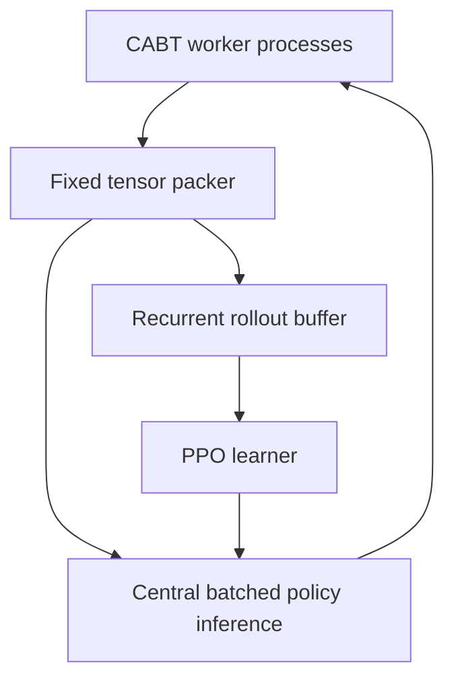

Your answers are enough to establish a strong provisional direction. We still should not choose the exact deck until we inspect fresh data, but we can now choose the RL architecture and engineering starting point.

## First, an important Orbit Wars correction

You are right about one part of the rank-2 Orbit result:

> A relatively small inference model can be gold-level.

Their final network was only about 4.3M parameters. However, it was trained for roughly 10B environment ticks using eight H100s over three long stages—approximately 576 H100-hours.

Therefore, Orbit rank 2 proves **small-model sufficiency**, not **small-training-compute sufficiency**.

For Pokémon, our bet must be:

* fewer but more informative decisions;
* a better semantic representation;
* a fixed deck that reduces the learning problem;
* extremely efficient native rollouts;
* population training that avoids wasting samples in a mirror equilibrium.

We should transfer rank 2’s systems principles, not attempt to reproduce its literal compute or GPU simulator.

## Recommended interpretation of “RL only”

Based on your answers, I recommend defining the project as:

> Every strategic action taken by the policy is learned from game rewards. No human/public-agent actions supervise the policy.

That produces these decisions:

| Component                          | v0 decision                                                       |
| ---------------------------------- | ----------------------------------------------------------------- |
| Behavior cloning                   | Excluded                                                          |
| Public actions as labels           | Excluded                                                          |
| Public replays                     | Meta analysis, opponent discovery and debugging only              |
| Replay outcomes for value training | Excluded initially                                                |
| Rule bots                          | Allowed as reward-only curriculum opponents                       |
| Legal-action masks                 | Required                                                          |
| Factual semantic card features     | Required                                                          |
| Reward shaping                     | Excluded initially                                                |
| Curriculum                         | Allowed through opponents/decks, without changing terminal reward |
| Recurrent memory                   | Required                                                          |
| Historical checkpoints             | Required                                                          |
| RL exploiters                      | Added after a competent champion exists                           |
| Privileged critic                  | Later ablation, not v0                                            |
| Search                             | Excluded from v0; preserve an interface for later testing         |
| Fixed deck                         | Selected manually/data-driven; in-game play remains fully RL      |
| Auxiliary prediction heads         | Later ablation using only our own rollouts                        |

A neural ranker does not require behavior cloning. Our policy head will be a neural ranker over legal options, but PPO will train its rankings from wins and losses.

## Recommended v0 agent

I recommend locking the initial model family as:

> **Entity-Transformer-GRU recurrent PPO, approximately 1.0–1.25M parameters.**

This is small enough for fast inference while retaining the relationships and memory a card game requires.

### State encoder

* Card-ID embedding: approximately 96 dimensions.

* Factual card metadata:

  * category and type;
  * HP and evolution stage;
  * retreat and energy costs;
  * attack and skill identifiers.

* Dynamic instance data:

  * owner and zone;
  * active/bench position;
  * damage and status;
  * attached energies and tools;
  * evolution state;
  * whether the card appeared this turn;
  * visibility/reveal status.

* Global data:

  * turn;
  * first player;
  * prizes;
  * deck and hand counts;
  * supporter, stadium, retreat and energy flags.

* Two entity-transformer blocks:

  * model width 128;
  * four attention heads;
  * feed-forward width 256.

* GRU with approximately 160 hidden units over public events, previous choices and reveals.

The transformer understands relationships among visible cards. The GRU remembers information that may disappear from the current observation.

### Legal-action policy

Every legal option becomes a semantic token containing:

* selection type and context;
* option type;
* card/source/target;
* player and area;
* attack or skill ID;
* count or numeric value;
* referenced in-play entity.

One batched forward pass scores every legal option. We do not run the entire model separately for each option.

For multi-select decisions:

1. Select one option.
2. Mask that option.
3. Update a small selection state.
4. Continue until the minimum count is satisfied.
5. Enable `STOP` when legally allowed.
6. Force termination at `maxCount`.
7. Store the sum of all sub-selection log probabilities as one compound PPO action.

This avoids the official sample’s first-64 truncation.

### Option-order robustness

For v0:

* Do not give the raw option-list position to the model.
* Randomly permute legal options during training.
* Map the chosen pointer back to the engine’s original index.

This prevents the policy from becoming an elaborate “choose option zero” agent.

If later evidence shows that stable engine ordering contains valuable information, we can run a controlled ablation.

### Critic and reward

Start with:

* shared actor/critic trunk;

* public-observation critic;

* terminal reward only:

  * win `+1`;
  * draw `0`;
  * loss `-1`.

* no damage, prize or resource shaping;

* no privileged hidden cards;

* entropy normalized by selection context and number of legal actions.

We should not copy a fixed discount factor from Orbit. A CABT “step” is a selection, while an Orbit tick is structurally different. During the initial environment benchmark, we will measure meaningful selections per game and then choose between:

* undiscounted full-episode returns, initially simplest;
* or a discount chosen from an explicit reward half-life.

Forced one-option decisions should update recurrent memory and value trajectories but receive no policy loss.

## Training algorithm

Start with custom synchronous recurrent PPO, written in a CleanRL-like style.

Do not begin with:

* Stable-Baselines3, because the action space is variable and autoregressive;
* R2D2, because recurrent replay, target networks, stale self-play data and compound actions add too much greenfield complexity;
* APPO, until ordinary PPO is correct and throughput is measured;
* PufferLib, until the observation/action contract exists as fixed tensors.

R2D2 remains a valid fallback if PPO’s measured sample efficiency fails a predetermined gate.

## High-speed infrastructure

The correct transfer from Orbit rank 2 is the hot-path architecture:

### Environment workers

* Start with approximately eight workers on your Ryzen 4800H.
* Scale to 16–64 workers on suitable Modal hardware.
* Each worker owns its native CABT lifecycle.
* Do not pass complete Python observation objects through queues.
* Convert states and legal options into preallocated numeric tensors.
* Use shared memory rather than repeated pickling.
* Never call visualization in the rollout path.
* Restart workers periodically or when RSS exceeds a threshold until memory stability is proven.

### Central inference

* One GPU process batches ready observations.
* Initial inference batch target: 16–128.
* Maximum batching delay: approximately 1–2 ms.
* Maintain recurrent state by environment ID.
* Cache the state representation during autoregressive multi-select.
* Group frozen-opponent inference by policy ID.

A 1M model does not need dual-GPU data parallelism. The second T4 is likely more valuable for concurrent evaluation or a separate experiment than DDP.

### PPO collection

* Freeze one policy version for each rollout collection.
* Collect perhaps 16k–64k meaningful current-policy decisions.
* Run 2–4 PPO epochs.
* Publish the new version.
* Continue from population-evaluated checkpoints rather than automatically treating the latest checkpoint as champion.

## Opponent curriculum

Your concern about weak public agents is valid. They are useful only as a bootstrap and regression test.

Recommended progression:

1. Random legal and engine-order baselines for correctness.
2. Public rule agents to teach through reward that obvious losing behavior is bad.
3. Current-policy self-play.
4. Frozen historical checkpoints.
5. PFSP opponent selection.
6. Dedicated RL exploiters.

PFSP means we prioritize opponents near a 50% matchup: difficult enough to expose weaknesses, but not so strong that almost every trajectory produces the same loss.

Once the policy confidently beats a weak rule agent, reduce that agent’s training probability. Do not remove it completely; otherwise later policies may forget basic competence.

Exploiters cannot guarantee a higher score. Nothing can. Their purpose is to discover policies that defeat the champion so those weaknesses can be repaired before the ladder discovers them.

## Throughput gates

We need to measure four different rates:

* raw native selections per second;
* encoded selections per second;
* neural-policy selections per second;
* completed games per second.

Do not compare CABT selections directly with Orbit ticks.

| Gate                    | Requirement                                                                              |
| ----------------------- | ---------------------------------------------------------------------------------------- |
| Correctness             | 1M random/forced legal selections with zero invalid actions or unexplained native errors |
| Memory                  | At least 6–12 hours without uncontrolled RSS growth                                      |
| Tensor packing          | Encoded throughput at least 70–80% of raw engine throughput                              |
| Minimum viable training | 500–1,000 policy decisions/second                                                        |
| Strong solo target      | 2,000–3,000 decisions/second                                                             |
| Stretch target          | 5,000–7,000 decisions/second                                                             |

At 2,000 decisions/second:

* one day produces about 173M decisions;
* 45 hours produces about 324M decisions.

Our initial target should be approximately 100–300M high-quality decisions, extending only while held-out population strength is improving.

If performance remains below 500 decisions/second after batching, we profile:

1. Python feature packing.
2. `ctypes` and native calls.
3. process communication.
4. inference batch size.
5. recurrent-state handling.

Only if packing consumes more than approximately 25–30% of wall time should we port the tensor-packing layer to C++/Rust/`pybind`.

I do not recommend rewriting the entire CABT simulator in JAX/CUDA during month one. That would create a simulator-parity project before we have an agent.

## Deck selection

Because you have no Pokémon background yet, neither you nor I should guess a deck from June anecdotes.

We should lock the **deck-selection procedure**, not the deck:

1. Collect recent episodes from:

   * current top 20;
   * ranks 21–100;
   * broader visible ladder;
   * daily top-episode index.

2. Use:

   * last three days for emerging trends;
   * last seven days as the main window;
   * last fourteen days only as a stability check.

3. Produce approximately 6–10 valid candidate deck families.

4. Measure each deck’s RL complexity:

   * decisions per game;
   * game length;
   * legal branching factor;
   * multi-select frequency;
   * rare contexts;
   * rollout throughput;
   * matchup spread.

5. Retain approximately 3–5 candidates.

6. Run the same small agent and same transition budget for each deck.

7. Compare:

   * learning-curve area;
   * expected win rate against fresh meta scenarios;
   * lower confidence bound;
   * worst major matchup;
   * seed variance;
   * first/second-player split;
   * throughput.

Spend approximately 5–10% of total training compute on this bakeoff. Prefer Colab and Modal for it so most Kaggle hours remain intact.

One specialist should be trained first. A second specialist begins only after the first architecture and learner pass objective gates.

Changing the deck after an objective bakeoff is not switching away from RL. It is choosing which fixed environment gives the RL system its best top-20 opportunity.

## Corrections to three of your answers

### 1. Safety fallback

Failing loudly is correct during development. It is not correct in the submitted agent.

Use two modes:

* **Development:** any invalid action, model exception or recurrent-state mismatch terminates the run and records the entire state.
* **Submission:** log the error counter and return a legal deterministic fallback.

Otherwise, one transient packaging or model error becomes an automatic ladder loss. The fallback does not hide the problem if it is separately counted and tested.

### 2. Twenty-five to fifty Kaggle games

Twenty-five to fifty games are enough for:

* submission validation;
* obvious crash detection;
* grossly weak-agent rejection.

They are not enough to distinguish two serious agents. Around a 50% rate, 50 games have roughly ±14 percentage-point sampling uncertainty before accounting for matchmaking differences.

The Kaggle ladder is the final truth, but local population evaluation must decide which experiments deserve ladder time.

### 3. Freezing only two days before the deadline

That is too late for a greenfield system. I recommend:

* major architecture freeze: seven days before the deadline;
* training/code freeze: four days before;
* final two days: packaging and emergency fixes only.

A T−2 architecture change might be stronger, but we would have no opportunity to diagnose a hidden runtime or matchup failure.

## What we can now lock provisionally

Subject to your confirmation:

* PyTorch.
* Custom synchronous recurrent PPO.
* One fixed-deck specialist first.
* Approximately 1.1M parameters.
* Two entity-transformer blocks plus GRU memory.
* Semantic legal-option ranking.
* Autoregressive multi-select.
* Public critic.
* Terminal reward only.
* No BC, shaping, search or privileged state in v0.
* Rule agents as reward-only bootstrap opponents.
* Current/frozen checkpoint league with PFSP.
* Exploiters after the first competent champion.
* Option-order permutation augmentation.
* Native CABT multiprocessing with central batched GPU inference.
* R2D2 retained only as a measured fallback.

## Remaining confirmations

Please answer these before we call the starting point final:

1. **Fixed-deck specialization:** Do you agree that the first agent uses one fixed deck selected through the quantitative bakeoff?

2. **Deck flexibility:** Is changing the selected deck after objective evidence allowed, provided the architecture and RL program remain unchanged?

3. **Risk objective:** Which should control deck/checkpoint selection?

   * highest estimated current-meta win rate;
   * strongest lower-confidence-bound/robustness;
   * highest learning ceiling despite greater variance.

   I recommend the second for a top-20 target.

4. **Architecture:** Do you approve the approximately 1.1M Entity-Transformer-GRU PPO design?

5. **Framework:** Do you approve a custom PyTorch/CleanRL-style trainer rather than SB3?

6. **Critic:** Do you approve a public critic for v0 and a privileged critic only as a later A/B test?

7. **Search:** Do you approve excluding search from v0 while preserving clean interfaces for a later measured experiment?

8. **Reward:** Do you approve terminal-only reward for v0, with shaping considered only after replay evidence identifies a specific learning failure?

9. **Rule opponents:** Do you approve rule agents as reward-only curriculum/evaluation opponents, with their probability reduced after they are beaten?

10. **Fallback:** Do you approve fail-loudly development mode plus a logged legal fallback in submission mode?

11. **Evaluation:** Do you accept 25–50 Kaggle games only as a smoke test, with serious decisions requiring more evidence?

12. **Freeze dates:** Do you accept architecture freeze at T−7 days and code/training freeze at T−4 days?

13. **Bakeoff budget:** May we reserve 5–10% of available compute for equal-budget deck selection?

14. **Automation:** May long Colab/Modal jobs and a daily meta collector run unattended beyond your personal 2–3 working hours?

15. **Second active slot:** Should we postpone deciding its deck until the first specialist is measured?

16. **Immediate file request:** Please download and attach the current official competition package containing:

* `ptcg_engine`;
* `sample_submission`;
* `EN_Card_Data.csv`;
* official deck/sample-agent files;
* any engine license/readme files.

Once you confirm these and attach the official package, the next discussion can lock the exact repository skeleton, tensor schemas, process architecture, PPO trajectory format, tests and first three-day implementation plan.

